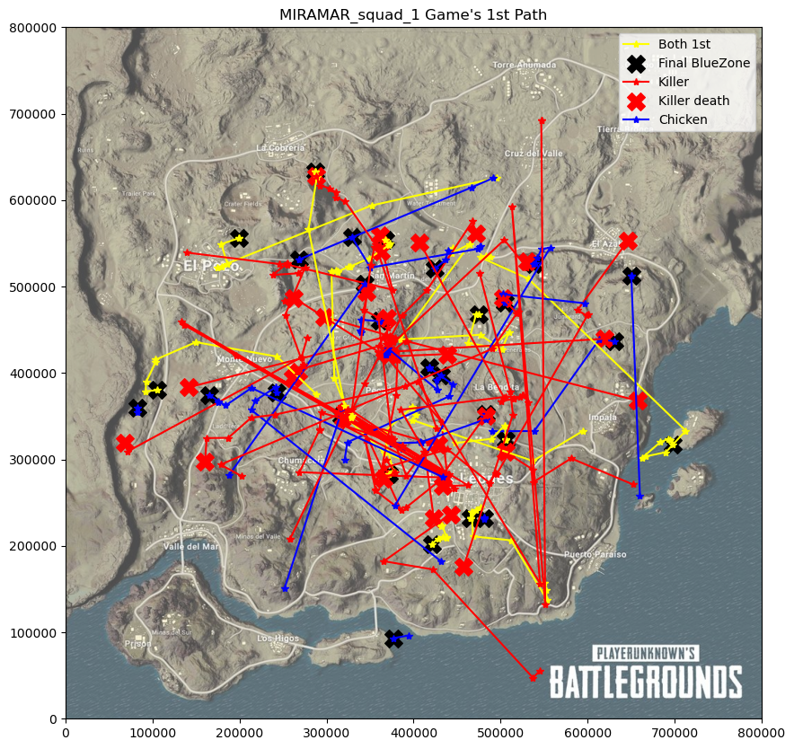

# PUBG_analysis
PUBG (PlayerUnknown's Battlegrounds) data analysis


## 프로젝트 개요

- 프로젝트 목표: 배틀그라운드 게임 순위를 높이는 법
- 맵과 클러스터 별로, [어느 지점, 어떤 무기]로 첫 킬을 낼 시 우승 확률이 높은지 확인.
- 프로젝트 전제 조건
- 데이터 사용 범위: 2017-2018년 동안의 배틀그라운드 매치 데이터를 사용.
- 상황에 따른 분류: 각 맵의 특성에 따라 스쿼드 인원별 전략이 달라지는 것을 고려해 분석을 진행.
- 특징 정의: 맵, 이동 거리, 플레이 시간, 파티 크기, 플레이어 데미지 등의 다양한 요인을 기반.
- 범위 제한: 주요 맵인 에란겔과 미라마를 대상으로 한정하여 분석.

## 1) 모델 기본 설계
|제목|내용|설명|
|------|---|---|
|
||
|||

- 위의 그림은 30판의 게임으로 plotting 하였음.
- 배틀그라운드를 플레이하는 사람들은 크게 3가지로 나뉜다고 가정.
- 다수의 사람들과의 교전을 즐기는 플레이어.
- 교전을 즐기지 않는 (생존을 우선시하는) 일명 존버 플레이어.
- 적당히 파밍하며 교전하는 일반적인 플레이어.
- 배틀그라운드 맵(에란겔/미라마)과 스쿼드(솔로/듀오/스쿼드)에 따라 플레이 스타일과 교전 지역이 달라질 것임을 가정하여 각각 분석.
- ‘player_dist_drive’의 여부로 보았을 때 생존 확률이 다른 것을 알 수 있음.


### 클러스터링 (미라마 - 솔로)

- 'player_dist_total', 'player_dmg', 'drive_type', 'player_kills’
- 4개의 columns로 clustering 진행.
- StandardScaler(), KMeans()를 통해 총 3개의 클러스터로 분류.
- violin plot을 확인해보았을 때, 아래와 같이 판단됨.
- cluster 0:  일반적 플레이어
- cluster 1: 급진적 플레이어
- cluster 2: 존버 플레이어
- 클러스터 별 생존 분석이 잘 되었다고 판단.


## 모델 성능 평가 (Score)


## 최종 모델 (Final Model)

Decision Tree, Random Forest가 높은 성능을 보이나, 처리 속도가 빠른 Decision Tree로 최종 모델 결정.


```python
# 예측 모델을 위한 데이터 준비
X = sample_df[['player_dist_total', 'player_dmg', 'cluster_0', 'cluster_1', 'cluster_2']]
y = (sample_df['team_placement'] <= 5).astype(int)  # 상위 5위 이내인지 여부
```